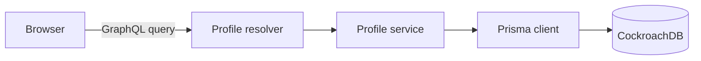

# Danil Belov — Digital Business Card

A backend-first portfolio project built for a TypeScript backend role. NestJS
serves a typed GraphQL API and the public business card, while Prisma persists
profile data in CockroachDB. The entire environment starts with Docker Compose.


## What it demonstrates

- strict TypeScript and NestJS module boundaries;
- a code-first GraphQL schema with explicit public models;
- Prisma relations and ordered profile content;
- professional experience sourced from the CV and exposed through GraphQL;
- a categorized technical toolkit covering frontend, backend, data, DevOps,
  CMS, development tools and additional languages;
- CockroachDB running as a single local Docker node;
- a multi-stage production Docker image;
- unit tests around mapping and failure behaviour;
- a documented Claude Code workflow in [`CLAUDE.md`](./CLAUDE.md).

## Architecture



The frontend is deliberately dependency-free. It uses the same public GraphQL
API that another client could consume.

## Run with Docker

Requirements: Git and Docker Desktop (or Docker Engine with Compose).

On Windows, after extracting the archive, you can also double-click
`OPEN_PROJECT_WINDOWS.bat`. It starts Docker Compose and opens the site in the
browser. To preview only the visual design without Docker, open
`public/index.html`; it falls back to local preview data when the API is absent.

```bash
git clone https://github.com/dn118/danil-digital-card.git
cd danil-digital-card
docker compose up --build
```

Open:

- business card: <http://localhost:3000>
- GraphQL endpoint: <http://localhost:3000/graphql>
- health check: <http://localhost:3000/health>
- CockroachDB console: <http://localhost:8080>

The app waits for CockroachDB, creates the schema and loads the seed data on
startup. The database volume persists between restarts.

## Local development without containerizing Node.js

Start only the database:

```bash
docker compose up database -d
cp .env.example .env
npm ci
npx prisma generate
npx prisma db push
npm run prisma:seed
npm run start:dev
```

## Example GraphQL query

```graphql
query DigitalCard {
  profile {
    name
    role
    skills
    skillGroups {
      title
      items
    }
    experience {
      role
      company
      period
    }
    projects {
      title
      technologies
    }
  }
}
```

Run it from a terminal:

```bash
curl http://localhost:3000/graphql \
  -H 'content-type: application/json' \
  --data '{"query":"{ profile { name role skills } }"}'
```

## Quality checks

```bash
npm run lint
npm test
npm run build
```

## Customization before publishing

Confirm every project URL in `prisma/seed.ts`. After changing seed content, run
`npm run prisma:seed` or restart the app container.

## Technology decisions

- **Code-first GraphQL** keeps the schema close to TypeScript models.
- **Explicit mapping** prevents accidental publication of database-only fields.
- **CockroachDB** matches the target production stack while keeping PostgreSQL
  protocol compatibility.
- **Plain browser JavaScript** keeps the exercise focused on backend engineering
  and avoids adding an unrelated frontend build pipeline.
- **Claude Code instructions** define review and verification rules; AI-assisted
  changes are treated like any other change and must pass the same checks.
